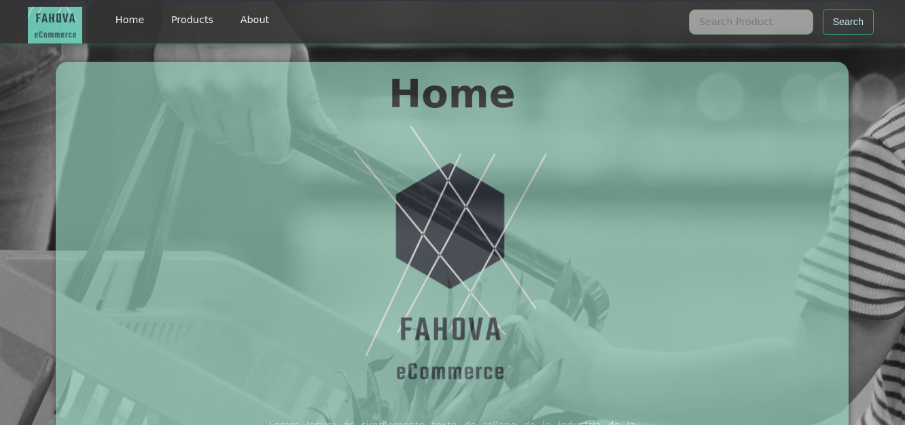
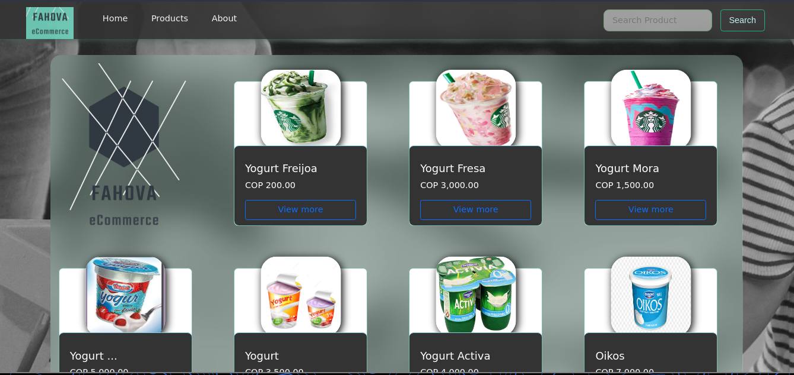
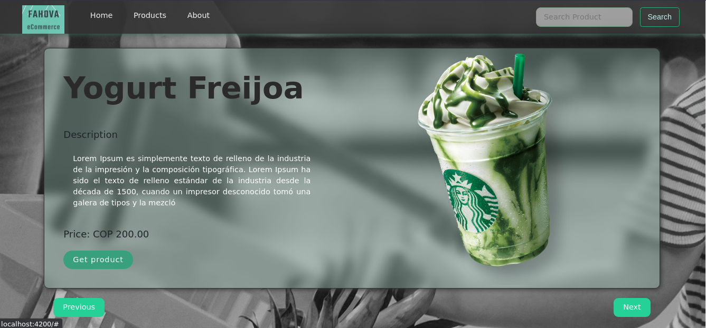

<h1 style="margin-top:10px;" align="center"> 🚀<strong> eCommerce angular </strong> 🔭
</h1>

## 🐧 Project explanation

eCommerce in angular

## 📷 Screenshots

### 🦀 Home

  

### 🦀 Products

  

### 🦀 Detail product

  

### 🦀 About

  

## 👾 To get started

1. Clone this repository: `https://github.com/fabianvera728/pipes-angular.git`.
2. Install dependencies: `npm install`
3. Run project: `ng serve`

## 🖋️ Authors

The developers have contributed to this project:

- Fabian Vera - <a href="https://github.com/fabianvera728"> fabianvera728 </a>
